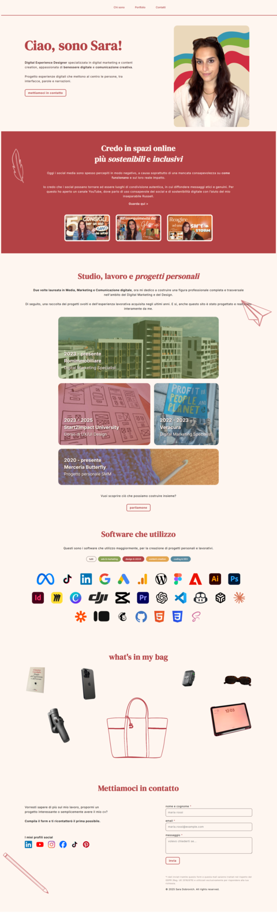

**Progetto Start2Impact - HTML e CSS - Sito Portfolio**

# Descrizione
Questo progetto è un sito web portfolio realizzato come progetto pratico per il corso di UX/UI Design di Start2Impact.  
L’obiettivo era mettere in pratica le conoscenze di sviluppo front-end e creare un sito personale per mostrare le mie competenze online.
Quindi, ho colto la palla al balzo e ho realizzato il mio primo e personalissimo portfolio online

# Struttura
Il sito è strutturato con 3 sezioni principali:
- Chi sono e valori
- Portfolio e software
  - Romimmobiliare
  - Start2Impact
  - Veracura
  - Merceria Butterfly
- Contatti con Form

# Tecnologie usate
- Visual Studio Code → editor per la scrittura del codice
- HTML5 → struttura del sito
- CSS3 → framework CSS per stile e layout dell'interfaccia web
- Sass (SCSS) → estensioni CSS per una gestione professionale dei fogli di stile
- JavaScript → interattività del form di contatto
- npm → gestione dei pacchetti e dipendenze
- Git & GitHub → versionamento del codice e repository online
- Figma → progettazione e prototipazione UI prima di mettere in struttura il codice

# SEO e Open Graph
Il sito è improntato in ottica SEO con tag Open Graph per garantire una condivisione ottimale sulle piattaforme di social media.

# Responsive Design
Il sito è interamente responsive e permette una corretta visualizzazione su tutti i dispositivi, siano essi desktop o mobile.

# Setup del progetto
Per visualizzare il sito in locale:
1. Clona la repository

   git clone https://github.com/saradobrovich/Portfolio-SD.git

2. Entra nella cartella del progetto

   cd Portfolio-SD

3. Installa le dipendenze

   npm install

4. Avvia il progetto

   npm start

In alternativa, puoi aprire direttamente `index.html` nel browser.

# Screenshot
Ecco un’anteprima del sito:  

# Autrice
Sara Dobrovich
- [GitHub](https://github.com/saradobrovich)
- [LinkedIn](https://www.linkedin.com/in/sara-dobrovich/)

